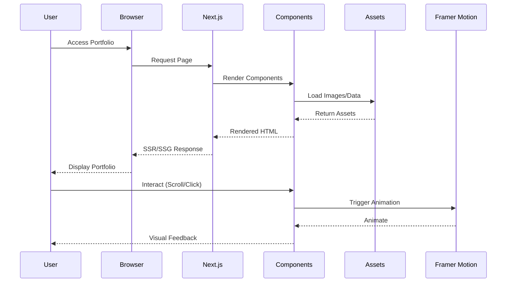
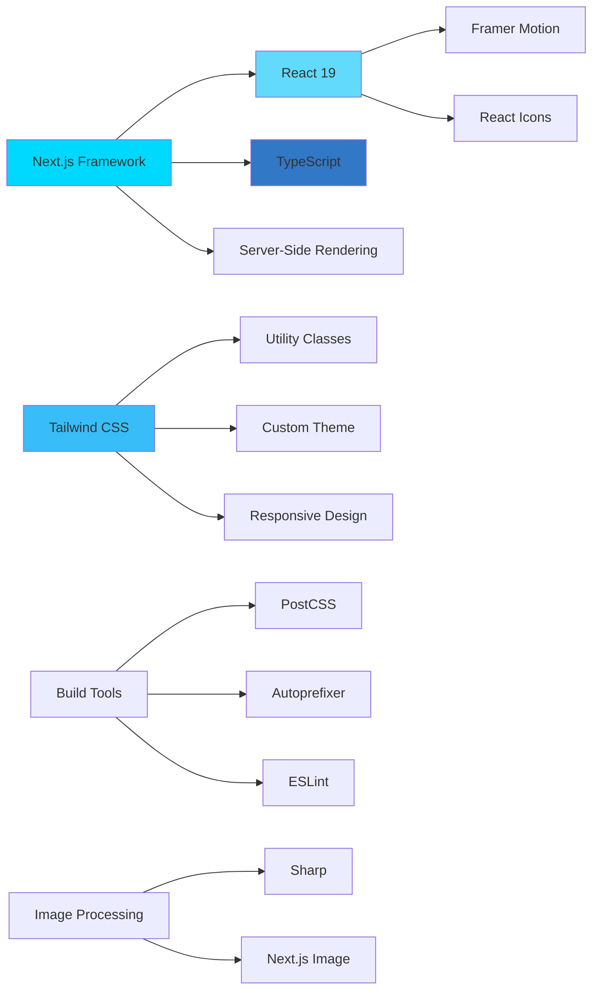

# Portfolio Website

A modern, responsive portfolio website showcasing professional experience, projects, and technical expertise. Built with Next.js and TypeScript, featuring smooth animations, responsive design, and optimal performance.

## 📋 Table of Contents

- [Overview](#overview)
- [Purpose](#purpose)
- [Technologies](#technologies)
- [Features](#features)
- [Project Structure](#project-structure)
- [Architecture](#architecture)
- [Installation](#installation)
- [Development](#development)
- [Build & Deployment](#build--deployment)
- [Code Quality](#code-quality)

## 🎯 Overview

This portfolio website serves as a comprehensive digital showcase for Daniel Fonseca da Silva, a System Architect specialising in FullStack Development, System Architecture, and Cloud Infrastructure. The site presents professional experience, featured projects, technical skills, and contact information through an elegant, modern interface.

## 🎨 Purpose

The primary objectives of this portfolio website are:

1. **Professional Presentation**: Display professional background, technical expertise, and career achievements in an organised, visually appealing manner.

2. **Project Showcase**: Highlight key projects including:
   - PDF Extractor API (RESTful API for document processing)
   - DafonCV (SaaS platform for CV generation)
   - Dafon Website (Corporate landing page)

3. **Experience Documentation**: Present detailed work experience across multiple companies (GT Group, Equiplano, MzTech, Wlabs, Exosfera, Leroy Merlin).

4. **Contact & Networking**: Provide multiple channels for professional contact and networking opportunities.

5. **Technical Demonstration**: Showcase modern web development practices, including responsive design, performance optimisation, and clean code architecture.

## 🛠 Technologies

### Core Framework & Language
- **Next.js 15.5.2**: React framework for production with server-side rendering and static site generation
- **React 19.1.1**: UI library for building component-based interfaces
- **TypeScript 5.9.2**: Type-safe JavaScript for enhanced code quality and developer experience

### Styling & UI
- **Tailwind CSS 3.4.0**: Utility-first CSS framework for rapid UI development
- **Tailwind Scrollbar 2.0.0**: Custom scrollbar styling plugin
- **Framer Motion 12.23.12**: Animation library for smooth, performant transitions
- **React Icons 5.5.0**: Comprehensive icon library

### Development Tools
- **ESLint 9.15.0**: Code linting and quality assurance
- **PostCSS 8.5.6**: CSS processing and transformation
- **Autoprefixer 10.4.21**: Automatic vendor prefix management
- **Sharp 0.34.3**: High-performance image processing

### Build & Runtime
- **Node.js**: >= 22.20.0
- **npm**: >= 10.9.0

## ✨ Features

### User Interface
- **Responsive Design**: Fully responsive layout optimised for mobile, tablet, and desktop devices
- **Smooth Animations**: Framer Motion-powered transitions and scroll animations
- **Dark Theme**: Modern dark colour scheme with cyan accent colours
- **Custom Scrollbar**: Styled scrollbar matching the site's aesthetic
- **Fixed Sidebars**: Social media links and email contact on desktop viewports

### Sections
1. **Banner**: Hero section with introduction and call-to-action
2. **About**: Professional background, technical skills, and expertise areas
3. **Experience**: Interactive work experience timeline with detailed company information
4. **Projects**: Featured projects with descriptions, technologies, and links
5. **Contact**: Contact form and social media integration
6. **Footer**: Additional information and links

### Performance Optimisations
- **Image Optimisation**: Next.js Image component with automatic optimisation
- **Code Splitting**: Automatic code splitting for optimal bundle sizes
- **Static Generation**: Pre-rendered pages for improved performance
- **React Strict Mode**: Enhanced development experience and error detection

## 📁 Project Structure

```
portfolio-website/
├── components/              # React components
│   ├── About.tsx           # About section component
│   ├── Banner.tsx          # Hero banner component
│   ├── Contact.tsx         # Contact form component
│   ├── Experience.tsx      # Work experience component
│   ├── Footer.tsx          # Footer component
│   ├── LeftSide.tsx        # Left sidebar (social links)
│   ├── Navbar.tsx          # Navigation bar component
│   ├── Projects.tsx        # Projects showcase component
│   ├── RightSide.tsx       # Right sidebar (email)
│   ├── SectiontTitle.tsx   # Section title component
│   ├── SubFooter.tsx       # Sub-footer component
│   └── works/              # Work experience detail components
│       ├── Equiplano.tsx
│       ├── Exosfera.tsx
│       ├── GtGroup.tsx
│       ├── LeroyMerlin.tsx
│       ├── MzTech.tsx
│       └── Wlabs.tsx
├── pages/                  # Next.js pages
│   ├── _app.tsx           # App wrapper with global styles
│   ├── _document.tsx      # Custom document configuration
│   └── index.tsx          # Home page
├── public/                 # Static assets
│   └── assets/
│       ├── cv/            # CV documents
│       ├── images/        # Image assets
│       └── projects/      # Project images
├── styles/                 # Global styles
│   └── globals.css        # Global CSS and Tailwind directives
├── next.config.js         # Next.js configuration
├── tailwind.config.js     # Tailwind CSS configuration
├── tsconfig.json          # TypeScript configuration
├── postcss.config.js      # PostCSS configuration
└── package.json           # Dependencies and scripts
```

## 🏗 Architecture

### Component Architecture

```mermaid
graph TD
    A[index.tsx] --> B[Navbar]
    A --> C[LeftSide]
    A --> D[Main Content]
    A --> E[RightSide]
    
    D --> F[Banner]
    D --> G[About]
    D --> H[Experience]
    D --> I[Projects]
    D --> J[Contact]
    D --> K[Footer]
    D --> L[SubFooter]
    
    H --> M[Work Components]
    M --> N[GtGroup]
    M --> O[Equiplano]
    M --> P[MzTech]
    M --> Q[Wlabs]
    M --> R[Exosfera]
    M --> S[LeroyMerlin]
    
    I --> T[Project Cards]
    T --> U[PDF Extractor API]
    T --> V[DafonCV]
    T --> W[Dafon Website]
    
    style A fill:#00d9ff
    style D fill:#0a0e27
    style F fill:#00b8d9
    style G fill:#00b8d9
    style H fill:#00b8d9
    style I fill:#00b8d9
    style J fill:#00b8d9
```



### Data Flow



### Technology Stack Diagram



## 🚀 Installation

### Prerequisites

Ensure you have the following installed:
- Node.js >= 22.20.0
- npm >= 10.9.0

### Steps

1. **Clone the repository**
   ```bash
   git clone <repository-url>
   cd portfolio-website
   ```

2. **Install dependencies**
   ```bash
   npm install
   ```

3. **Run development server**
   ```bash
   npm run dev
   ```

4. **Open in browser**
   Navigate to `http://localhost:3000`

## 💻 Development

### Available Scripts

- `npm run dev`: Start development server with hot reload
- `npm run build`: Create production build
- `npm run start`: Start production server
- `npm run lint`: Run ESLint for code quality checks

### Development Guidelines

#### Code Quality Standards
- **SOLID Principles**: Follow Single Responsibility, Open/Closed, Liskov Substitution, Interface Segregation, and Dependency Inversion principles
- **Clean Code**: Write readable, maintainable, and self-documenting code
- **Object Calisthenics**: Apply object-oriented best practices and design patterns
- **TypeScript**: Leverage type safety for better code reliability
- **Component Composition**: Build reusable, composable React components

#### Component Structure
- Each component should be self-contained and focused on a single responsibility
- Use TypeScript interfaces for props and data structures
- Implement proper error handling and loading states
- Follow consistent naming conventions (PascalCase for components)

#### Styling Guidelines
- Use Tailwind CSS utility classes for styling
- Maintain consistent spacing using Tailwind's spacing scale
- Follow the established colour scheme defined in `tailwind.config.js`
- Ensure responsive design using Tailwind's breakpoint system

#### Performance Best Practices
- Optimise images using Next.js Image component
- Implement code splitting for large components
- Use React.memo for expensive components when appropriate
- Minimise bundle size by importing only necessary dependencies

## 🏭 Build & Deployment

### Production Build

```bash
npm run build
```

This command:
- Compiles TypeScript to JavaScript
- Optimises images and assets
- Generates static pages where possible
- Creates an optimised production bundle

### Deployment Options

#### Vercel (Recommended)
1. Push code to GitHub/GitLab/Bitbucket
2. Import project in Vercel
3. Configure build settings (auto-detected for Next.js)
4. Deploy

#### Other Platforms
- **Netlify**: Configure build command as `npm run build` and publish directory as `.next`
- **AWS Amplify**: Connect repository and configure build settings
- **Docker**: Create Dockerfile and deploy to container platforms

### Environment Variables

Currently, no environment variables are required. If needed in the future, create a `.env.local` file:

```env
# Example environment variables
NEXT_PUBLIC_API_URL=https://api.example.com
```

## 📊 Code Quality

### Linting
The project uses ESLint with Next.js configuration. Run linting with:

```bash
npm run lint
```

### Type Checking
TypeScript provides compile-time type checking. Ensure types are properly defined for all components and functions.

### Code Organisation
- **Components**: Located in `/components` directory, organised by feature
- **Pages**: Next.js pages in `/pages` directory
- **Styles**: Global styles in `/styles` directory
- **Assets**: Static assets in `/public` directory

## 📝 License

This project is private and proprietary.

## 👤 Author

**Daniel Fonseca da Silva**
- System architect
- FullStack Developer
- Specialising in Backend Architecture, Cloud Infrastructure, and DevOps

---

Built with ❤️ using Next.js, React, and TypeScript

